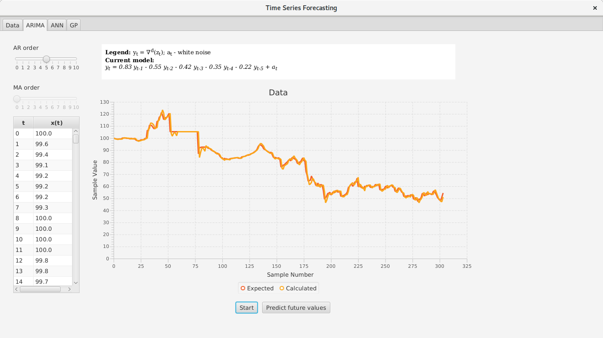

Projekt napravljen u sklopu predmeta *Projekt iz programske potpore*
na 3. godini preddiplomskog studija na [Fakultetu elektrotehnike i računarstva](https://www.fer.unizg.hr/)
pod mentorstvom [doc. dr. sc. Marka Čupića](https://www.fer.unizg.hr/marko.cupic) u akademskoj godini 2017./2018.

---

## Opis projekta
Vremenska serija poredani je niz podataka $x(t),\ t \geq 0$ gdje je $x(t)$
tipično skalarna vrijednost.

Problem predikcije vremenske serije jest problem predviđanja jedne ili više
sljedećih vrijednosti na temelju prethodno viđenih vrijednosti.

U okviru ovog projekta razvili smo aplikaciju za predviđanje vremenskih serija
koristeći statističke modele, modele temeljene na umjetnim neuronskim
mrežama i model temeljen na genetskom programiranju.

## Opis rješenja
### Razvijeni modeli
Od statističkih modela implementirali smo AR (*Auto regressive*) i MA (*Moving average*) modele.

Implementirali smo dvije umjetne neuronske mreže: umjetnu neuronsku mrežu s vremenskim
odmakom (engl. *Time Delay Neural Network*, skraćeno *TDNN*) i Elmanovu neuronsku mrežu.
*TDNN* je ustvari potpuno povezana unaprijedna neuronska mreža koja na ulaz dobiva
$n$ prošlih vrijednosti, a na izlazu daje jednu ili više vrijednosti koje predviđa.

U genetskom programiranju koristimo stablo operatora kako bi pronašli izraz koji
najbolje predviđa zadanu vremensku seriju.

### Treniranje umjetne neuronske mreže
Umjetne neuronske mreže možemo trenirati s četiri metaheuristike: simulranim kaljenjem,
populacijskim genetskim algoritmom, genetskim algoritmom sa selekcijom potomstva
(engl. *Offspring selection genetic algorithm*) i optimizacijom roja čestica
(engl. *Particle swarm optimization*). Osim metaheuristika, implementirali smo
algoritam unazadne propagacije (engl. *Backpropagation*).

### Prikaz rješenja metaheuristike
Metaheuristike traže parametre umjetne neuronske mreže. Parametri umjetne neuronske
mreže s vremenskim odmakom su njezine težine, a parametri Elmanove neuronske mreže
su njezine težine i početne vrijednosti kontekstnog sloja.

Rješenje metaheuristike je vektor realnih brojeva koji sadrži parametre umjetne
neuronske mreže. Broj komponenti vektora rješenja jednak je broju parametara
umjetne neuronske mreže.

Kaznu rješenja definirali smo kao srednju kvadratnu pogrešku koju umjetna neuronska
mreža ostvaruje nad ulaznim skupom podataka. Dobrotu rješenja definirali smo kao
negativnu kaznu.

#### Simulirano kaljenje
Simulirano kaljenje koristi geometrijsko hlađenje. Susjede generiramo dodavanjem
slučajnog broja, iz Gaussove razdiobe, na trenutnu vrijednost komponente rješenja.

Korisnik kroz sučelje može odabrati početnu i završnu temperaturu hlađenja, te
može unesti proizvoljan parametar $\sigma$ Gaussove razdiobe.

#### Genetski algoritam
Implementirali smo populacijski genetski algoritam koristeći turnirsku selekciju,
*BLX*-$\alpha$ križanje i mutaciju Gaussovom razdiobom.

#### Optimizacija rojem čestica
Koristimo jednostavnu regulaciju brzine čestice. Čestica može biti potpuno ili
djelomično informirana u potpuno povezanoj topologiji.

### Algoritam unazadne propagacije
Korisnik može odabrati proizvoljan broj iteracija. Treniranje može biti grupno
ili pojedinačno, te se može koristiti proizvoljna stopa učenja $\mu$.

### Genetsko programiranje
U stablo operatora koje predstavlja izraz s kojim predviđamo vremensku seriju
mutiramo i križamo njegova podstabla.

## Članovi tima
|||
|:---|:---:|
|[Luka Banović](https://github.com/LBanovic) (voditelj tima)|statistički modeli, grafičko korisničko sučelje, dokumentacija|
|[Herman Zvonimir Došilović](https://github.com/hermanzdosilovic)|evolucijski algoritmi, umjetne neuronske mreže, web stranica|
|[Matej Grcić](https://github.com/matejgrcic)|*backpropagation* algoritam, umjetne neuronske mreže, grafičko korisničko sučelje|
|[Marin Sokol](https://github.com/marinsokol5)|statistički modeli, genetsko programiranje, grafičko korisničko sučelje|

## Preuzimanja
* Izvorni kôd ([zip](https://github.com/hermanzdosilovic/time-series-forecasting/archive/master.zip))

* Izvršni kôd ([jar](https://github.com/hermanzdosilovic/time-series-forecasting/raw/master/time-series-forecasting.jar))

* Prezentacija ([pdf](https://github.com/hermanzdosilovic/time-series-forecasting/raw/master/prezentacija.pdf))

* Korisničke upute ([pdf](https://github.com/hermanzdosilovic/time-series-forecasting/raw/master/upute.pdf))

## Slike

---

© 2018. [Fakultet elektrotehnike i računarstva](https://www.fer.unizg.hr/), [Sveučilište u Zagrebu](http://www.unizg.hr/)

